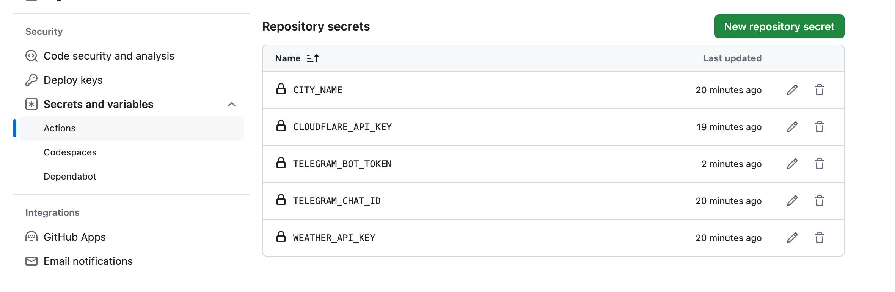

# George Telegram Bot
## Features

The robot currently provides the following features:
- **Daily Message**: Send weather and exchange rate to Telegram every day.
- **Weather Image**: Generate weather image via Cloudflare Worker AI.

## How to use
1. **Create Telegram Bot**: Search for `@BotFather`, use `/newbot` to create a bot
2. **Add Bot to your Telegram channel**
3. **Add secrets in your repository** (In your repository's settings page - Security/Secrets and variables/Actions)

   * **TELEGRAM_BOT_TOKEN**: Get from `@BotFather` telegram bot
   * **TELEGRAM_CHAT_ID**
     * log in under your account at web version of Telegram: https://web.telegram.org
     * updated (thanks @Julian Espinel) Find your channel. See to your URL. It should be like https://web.telegram.org/z/#-1001543515057
     * Grab "-1001543515057" from it, it's your channel's chat id.
   * **WEATHER_API_KEY**: Get API KEY from https://openweathermap.org
   * **CITY_NAME**